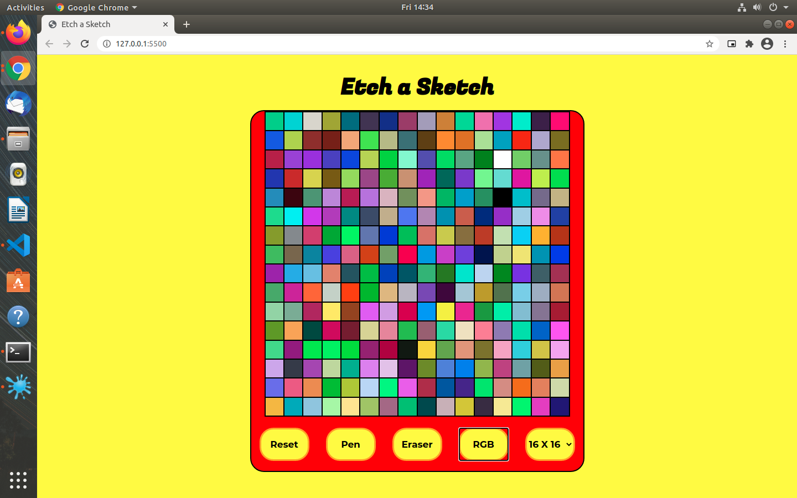

# Etch a Sketch

>The goal of this project was to build an Etch a Sketch app using Javascript.



# Live Website
https://rawcdn.githack.com/jacobrees/Etch-a-Sketch/9693646c4a499eb373f15e62e91f89771f135ac8/index.html

# Getting Started

To get a local copy of the repository please run the following commands on your terminal:

```
$ cd <folder>
```

```
$ git clone git@github.com:jacobrees/Etch-a-Sketch.git
```


```
$ cd Etch-a-Sketch
```

## Built With

- HTML
- CSS
- JavaScript

## Authors

👤 **Jacob Rees**

- Github: [@jacobrees](https://github.com/jacobrees)
- Linkedin: [jacob-rees-a6507b1a6](https://www.linkedin.com/in/jacob-rees-a6507b1a6/)


## 🤝 Contributing

Contributions, issues and feature requests are welcome!

## Show your support

Give a ⭐️ if you like this project!

## Acknowledgments

- Project inspired by The Odin Project
